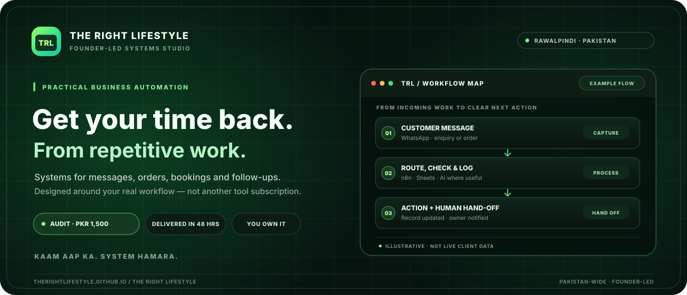
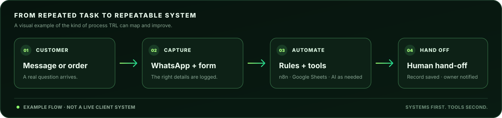

<h1 align="center">TRL — The Right Lifestyle</h1>

<p align="center">
  <strong>Founder-led business systems &amp; practical automation for online and local businesses across Pakistan.</strong><br>
  <em>Kaam aap ka, system hamara.</em>
</p>

<p align="center">
  <a href="https://therightlifestyle.github.io/TheRightLifestyle/">🌐 Official website</a>
  &nbsp;·&nbsp;
  <a href="https://wa.me/923190091457">💬 Talk to the founder</a>
  &nbsp;·&nbsp;
  <a href="https://therightlifestyle.github.io/TheRightLifestyle/pricing.html">📋 Services &amp; pricing</a>
</p>

<p align="center">
  
</p>

<p align="center">
  <a href="#what-trl-does">What we do</a> &nbsp;·&nbsp;
  <a href="#who-we-work-with">Who we help</a> &nbsp;·&nbsp;
  <a href="#how-an-engagement-works">How it works</a> &nbsp;·&nbsp;
  <a href="#meet-the-founder">The founder</a> &nbsp;·&nbsp;
  <a href="#about-this-repository">Website source</a> &nbsp;·&nbsp;
  <a href="#contact">Contact</a>
</p>

---

## What TRL does

**TRL — The Right Lifestyle** is a founder-led systems studio based in Rawalpindi, Pakistan. We help business owners spend less time repeating admin by mapping the way their business actually runs, then building practical systems for the work worth automating.

Think WhatsApp messages, orders, bookings, follow-ups, invoices and reports — connected into a workflow your team can understand and own. We work with online and local businesses, remotely across Pakistan and in person in Rawalpindi and Islamabad.

| Capture & convert | Run day-to-day | Stay in control |
|---|---|---|
| WhatsApp Business replies, enquiry capture, lead follow-up and English / Roman Urdu FAQ assistance | Order and booking flows, COD confirmation, reminders, invoices, receipts and payment follow-up | Simple Google Sheets systems, lead lists, reporting dashboards and weekly summaries |

**Practical toolkit:** WhatsApp Business · Google Sheets · n8n · AI where it genuinely helps. We start with the workflow, not a pitch for more software.

## A simple system, built around your business

<p align="center">
  
</p>

<p align="center"><sub>Illustrative workflow only — each system is mapped to the client's real process. AI is optional; human hand-off stays available.</sub></p>

## Who we work with

| Online &amp; digital businesses | Local &amp; physical businesses |
|---|---|
| E-commerce and Daraz sellers · coaches and academies · agencies and freelancers · creators and digital businesses | Shops and boutiques · clinics, salons and gyms · restaurants and home kitchens · schools, real estate and local services |

## How an engagement works

1. **Start with a conversation.** Tell us what the business does and what takes up your time. English or Roman Urdu — whichever feels natural.
2. **Map the work.** The Systems Audit identifies how work flows today, where time or leads are being lost, and what is worth fixing first.
3. **Agree on a written scope.** If a build makes sense, you get the exact deliverable, tools, timeline and fixed price before work begins.
4. **Build, test and hand over.** The system is tested on real scenarios, documented, and handed over with your accounts and access in your control.

### Published founding offers

| Step | Founding price | What you get |
|---|---:|---|
| **Systems Audit** | **PKR 1,500** | Systems map PDF, opportunities ranked by impact, and a recorded 30-minute walkthrough call. Delivered within 48 hours of intake. |
| **System Build** | **PKR 15,000** | One agreed system, built around your real workflow, tested, documented and handed over, with 14 days of fixes after launch. |
| **Care Plan** *(coming soon)* | **PKR 3,000–5,000 / month** | Optional monitoring, fixes and small changes for build clients. |

<blockquote>
  <strong>Founding pricing:</strong> published prices apply to the first 50 clients and may change when those places are filled. The full Systems Audit fee is credited to a build started within 14 days. Check the <a href="https://therightlifestyle.github.io/TheRightLifestyle/pricing.html">live pricing page</a> for current details.
</blockquote>

## The principles behind the work

| Systems before tools | Clear scope, honest pricing |
|---|---|
| Understand the process first. Automate only the parts that are useful to automate. | Work, timing and price are agreed in writing before a build starts. |
| **You own the system** | **People stay in the loop** |
| Your accounts, data and documentation stay yours. No lock-in. | AI can handle routine questions; sensitive or uncertain cases go to a person. No spam or unsolicited bulk messaging. |

## Meet the founder

**Rashid Muhammad Amir** is the founder of TRL and the person clients deal with from the first conversation through handover.

TRL is built around a straightforward idea: a business should not depend on its owner personally pushing every repeated task. The aim is to give owners more room for growth, family and life — with simple systems, transparent pricing and no made-up proof points.

<a href="https://therightlifestyle.github.io/TheRightLifestyle/about.html">More about Rashid &amp; the TRL approach →</a>

## About this repository

This repository contains the source for the [official TRL website](https://therightlifestyle.github.io/TheRightLifestyle/), published with GitHub Pages.

- **Lightweight:** hand-written HTML, CSS and JavaScript; no frontend framework or runtime dependency.
- **Content-led:** `tools/build.py` is the source of truth for the site copy, prices and contact details; the HTML pages are generated from it.
- **Built for real devices:** responsive layouts, accessible navigation and reduced-motion support.
- **Privacy-minded:** no cookies, database or tracking scripts on the site; fonts are self-hosted.
- **Search-ready:** includes page metadata, Open Graph, structured data, sitemap and robots file.

### Project layout

```text
.
├── README.md                 # Company, founder and project overview
├── trl-cover.svg              # README hero artwork
├── trl-workflow.svg           # README workflow artwork
├── tools/build.py             # Source content and static-page generator
├── index.html                 # Generated website pages
├── services.html
├── pricing.html
├── about.html
├── assets/
│   ├── css/style.css
│   ├── js/main.js
│   ├── fonts/                 # Self-hosted fonts
│   └── img/                   # Site logo and social images
├── sitemap.xml
├── robots.txt
└── .nojekyll
```

### Run the site locally

Requires Python 3.8 or newer; no package installation is needed.

```bash
# Regenerate the website after editing tools/build.py
python3 tools/build.py

# Start a local preview
python3 -m http.server 8080
```

Then open `http://localhost:8080`. Edit `tools/build.py` rather than generated HTML files, or the next build will overwrite those changes. The live site is deployed from the `main` branch with GitHub Pages.

## Contact

| | |
|---|---|
| **Website** | [therightlifestyle.github.io/TheRightLifestyle](https://therightlifestyle.github.io/TheRightLifestyle/) |
| **WhatsApp** | [+92 319 0091457](https://wa.me/923190091457) |
| **Email** | [officialtrlservice@gmail.com](mailto:officialtrlservice@gmail.com) |
| **Instagram** | [@the.right.lifestyle](https://www.instagram.com/the.right.lifestyle/) |
| **TikTok** | [@the.right.lifestyle](https://www.tiktok.com/@the.right.lifestyle) |
| **Based in / serving** | Rawalpindi, Pakistan · Online across Pakistan · In person in Rawalpindi / Islamabad |
| **Reply hours** | Every day, 10:00–22:00 PKT |

<p align="center">
  <a href="https://wa.me/923190091457?text=Assalam%20o%20Alaikum%20Rashid%2C%20I%20found%20TRL%20online.%20I%27d%20like%20to%20talk%20about%20my%20business."><strong>Start a conversation on WhatsApp →</strong></a>
</p>

<p align="center"><sub>TRL is in its founding stage. No invented client counts, testimonials or savings claims — only work and results that can be substantiated.</sub></p>

---

<p align="center"><sub>© 2026 <strong>TRL — The Right Lifestyle</strong> · Rashid Muhammad Amir · See <a href="LICENSE">LICENSE</a>.</sub></p>
