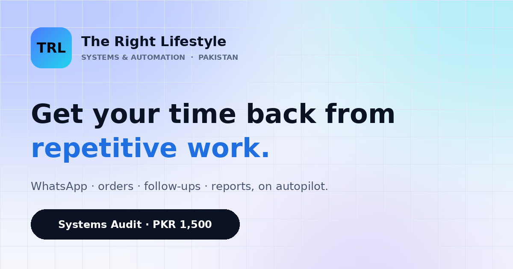

<div align="center">


# TRL — The Right Lifestyle

**Business systems & automation for online and local businesses in Pakistan.**

_Kaam aap ka, system hamara._

[](https://therightlifestyle.github.io/TheRightLifestyle/)
[](CHANGELOG.md)
[](https://wa.me/923190091457)

[**Visit the website →**](https://therightlifestyle.github.io/TheRightLifestyle/)

</div>

<br>

<p align="center"></p>

---

## About

**TRL — The Right Lifestyle** is a founder-led systems studio based in Rawalpindi, Pakistan, run by **Rashid Muhammad Amir**.

We find the repetitive work inside a business, like WhatsApp replies, orders, bookings, follow-ups, invoices and reports, and build systems that handle it automatically. We use tools owners already know: **WhatsApp Business, Google Sheets, n8n and AI**.

This repository is the source of the official TRL website.

## Offers

| Step | Offer | Founding price · first 50 clients | Standard price | What's included |
|:---:|---|---|---|---|
| 1 | **Systems Audit** | **PKR 1,500** | PKR 3,000 | Systems map PDF + 30-min recorded walkthrough call · delivered in 48 h |
| 2 | **System Build** | **PKR 15,000** | from PKR 25,000 | One complete system, tested, documented and handed over · 14 days of fixes |
| 3 | **Care Plan** | PKR 3,000–5,000 / month | — | Monitoring, fixes and small changes · *coming soon* |

> The audit fee is **credited in full** to any build that starts within **14 days**.

## Who we serve

| Online & digital (Pakistan-wide) | Local & physical (Rawalpindi / Islamabad + online) |
|---|---|
| E-commerce & Daraz sellers | Shops, boutiques & showrooms |
| Coaches & online academies | Clinics, salons & gyms |
| Agencies & freelancers | Restaurants & home kitchens |
| Content creators & digital products | Schools & tuition centres |
| Dropshippers & resellers | Real estate & property |
| Online service providers | Trades & home services |

## Website

| Page | Purpose |
|---|---|
| [`index.html`](index.html) | Home: hero offer, problems, audiences, services, process, pricing |
| [`services.html`](services.html) | All eight service areas with example workflows |
| [`who-we-help.html`](who-we-help.html) | Examples for 12 business types |
| [`pricing.html`](pricing.html) | Price ladder, comparison table, Easypaisa payment steps |
| [`how-it-works.html`](how-it-works.html) | 7-step journey from first message to handover |
| [`about.html`](about.html) | Founder & principles |
| [`faq.html`](faq.html) | 14 answers (with FAQPage structured data) |
| [`contact.html`](contact.html) | WhatsApp enquiry builder: no data stored |
| [`privacy.html`](privacy.html) · [`terms.html`](terms.html) | Legal |

### Highlights

- ⚡ **Zero dependencies.** Hand-written HTML, CSS and JS, with no frameworks, CDNs or trackers.
- 📱 **Mobile-first and responsive**, with accessible navigation, skip link and reduced-motion support.
- 🔍 **SEO-ready.** Canonical URLs, Open Graph, Twitter cards, JSON-LD, sitemap and robots.
- 🔒 **Privacy by design.** No cookies, no database, and fonts are self-hosted.
- 🛠️ **One source of truth.** Every price, phone number and link lives at the top of `tools/build.py`.

## Project structure

```
TheRightLifestyle/
├── index.html … terms.html, 404.html   # Generated pages (served by GitHub Pages)
├── assets/
│   ├── css/style.css                   # Design system & components
│   ├── js/main.js                      # Nav, scroll reveal, WhatsApp form
│   ├── fonts/                          # Sora + Instrument Sans (self-hosted)
│   └── img/                            # Logo, app icon, social share image
├── tools/build.py                      # Page generator — edit content here
├── sitemap.xml · robots.txt · manifest.webmanifest
├── .well-known/security.txt
├── .nojekyll                           # Serve files as-is on GitHub Pages
├── CHANGELOG.md
└── LICENSE
```

## Editing the site

All content lives in **`tools/build.py`**: prices, contact details, hours, social links and page copy.

```bash
# 1. Edit tools/build.py (e.g. AUDIT = "1,500")
# 2. Regenerate every page
python3 tools/build.py
# 3. Preview locally at http://localhost:8080
python3 -m http.server 8080
# 4. Publish
git add -A && git commit -m "Update pricing" && git push
```

> Requires Python 3.8+ with no extra packages. Don't edit the `.html` files directly, because your changes are overwritten on the next build.

## Deployment

Hosted on **GitHub Pages** from the `main` branch (root).
**Settings → Pages → Source: Deploy from a branch → `main` / `(root)`**.
Every push to `main` goes live within about a minute.

## Contact

| | |
|---|---|
| 💬 WhatsApp | [+92 319 0091457](https://wa.me/923190091457) |
| ✉️ Email | [officialtrlservice@gmail.com](mailto:officialtrlservice@gmail.com) |
| 📸 Instagram | [@the.right.lifestyle](https://www.instagram.com/the.right.lifestyle/) |
| 🎵 TikTok | [@the.right.lifestyle](https://www.tiktok.com/@the.right.lifestyle) |
| 🕙 Hours | Every day, 10am–10pm PKT |
| 📍 Based in | Rawalpindi, Punjab, Pakistan |

---

<div align="center">

© 2026 **TRL — The Right Lifestyle** · Rashid Muhammad Amir · All rights reserved. See [LICENSE](LICENSE).

</div>
