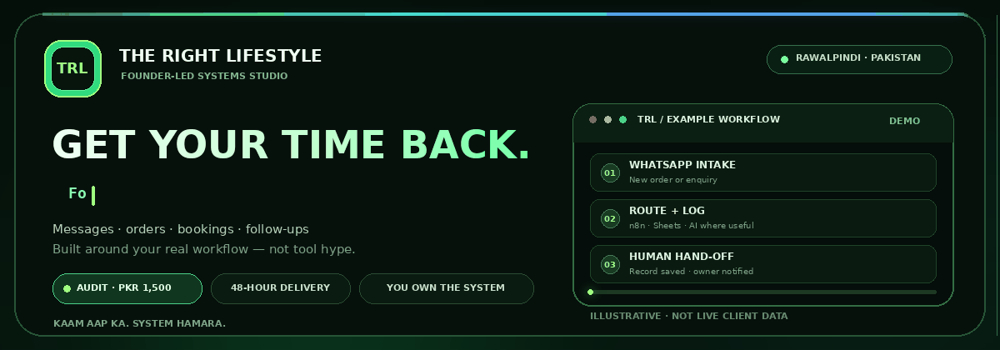
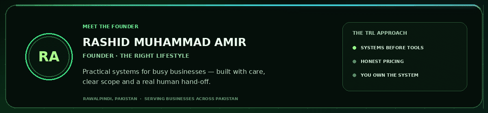
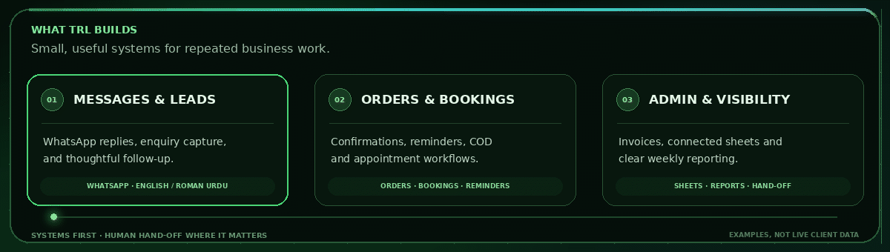
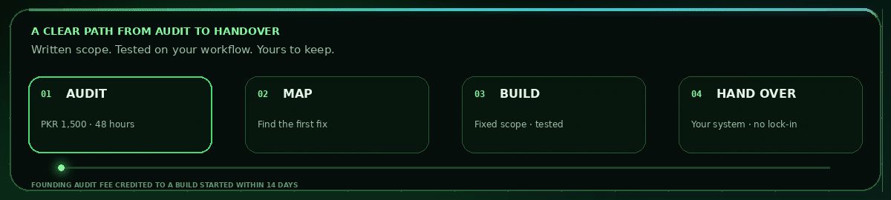

  

<strong>Founder-led business systems &amp; automation · Rawalpindi, Pakistan</strong>

  <a href="https://therightlifestyle.github.io/TheRightLifestyle/">🌐 WEBSITE</a>
  &nbsp;·&nbsp;
  <a href="https://wa.me/923190091457">💬 WHATSAPP</a>
  &nbsp;·&nbsp;
  <a href="mailto:officialtrlservice@gmail.com">✉️ EMAIL</a>
  &nbsp;·&nbsp;
  <a href="https://github.com/therightlifestyle/TheRightLifestyle">💻 FEATURED PROJECT</a>

  
  

---

## ⚡ Meet the Founder

  

I’m **Rashid Muhammad Amir**, founder of **TRL — The Right Lifestyle**, based in Rawalpindi, Pakistan. I help business owners spend less time answering the same messages, re-entering orders and chasing follow-ups. We map the real workflow first, then automate only what is worth improving.

**Kaam aap ka, system hamara.**

## 🧩 What TRL builds

  

- **Messages &amp; leads:** WhatsApp replies, enquiry capture, English / Roman Urdu FAQ help and thoughtful follow-up.
- **Orders &amp; bookings:** order capture, COD confirmation, appointment flows and reminders.
- **Admin &amp; visibility:** invoices, connected Google Sheets, simple dashboards and useful summaries.

**Tools:** WhatsApp Business · Google Sheets · n8n · AI where it helps, with a person in the loop when needed.

## 🧭 How I work

  

The published founding offer is a **PKR 1,500 Systems Audit** for the first 50 clients, delivered within 48 hours. The full audit fee is credited to a build started within 14 days. Scope and price are agreed in writing; you keep your accounts, access and documentation. [See current pricing →](https://therightlifestyle.github.io/TheRightLifestyle/pricing.html)

## 🧰 Website toolkit

  
  
  
  

The official TRL site is hand-written HTML, CSS and JavaScript, with a small Python page generator.

## ✨ Featured project

  

The source for the [official TRL website](https://therightlifestyle.github.io/TheRightLifestyle/).

## 📊 GitHub pulse

  

  

  

### Contribution calendar

  

These are live embeds of public GitHub activity. They may take a moment to load; stats and project details are not invented.

## 🤝 What I believe

Automation should mean **less work to manage**, not one more complicated tool. TRL is founder-led, upfront about pricing and focused on systems clients own. We’re early, so I share real work — never invented reviews, client counts or savings claims.

## 📬 Let’s talk

- **Website:** [The Right Lifestyle](https://therightlifestyle.github.io/TheRightLifestyle/)
- **WhatsApp:** [+92 319 0091457](https://wa.me/923190091457)
- **Email:** [officialtrlservice@gmail.com](mailto:officialtrlservice@gmail.com)
- **Instagram:** [@the.right.lifestyle](https://www.instagram.com/the.right.lifestyle/)
- **TikTok:** [@the.right.lifestyle](https://www.tiktok.com/@the.right.lifestyle)
- **Based in:** Rawalpindi, Pakistan · serving businesses across Pakistan online

<strong>Let’s make everyday business lighter. 🤝</strong> © 2026 Rashid Muhammad Amir · TRL — The Right Lifestyle

